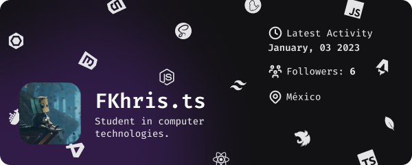

# Hi there!, [**It's Christian**](https://christianfl.netlify.app/) :man_technologist:

I'm a computer technology student, passionate about web technologies :sparkling_heart:.

My area of interest is website design and development, accessible and user-friendly design. Whenever possible, I also use my passion to develop projects using *Node.js* and *JavaScript* libraries and frameworks like *React*.

Some of my platforms...

- [GitHub](https://github.com/FLCHRIS)
- [Website](https://christianfl.netlify.app/)

## :seedling: **I’m currently learning:**

## **My skills**

Frontend technology that I master are the following:

Development tools:

Other knowledge:

**Happy coding!** :v:
